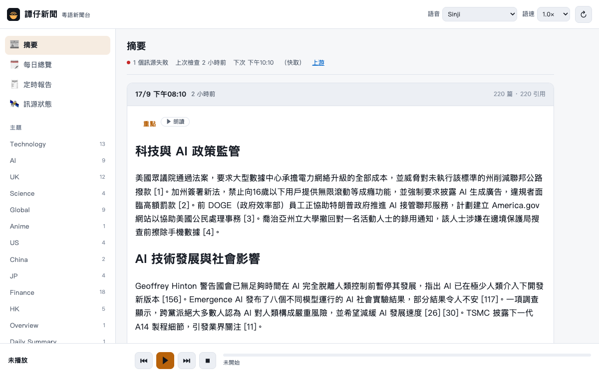

# 譚仔新聞 · 粵語新聞台

A Cantonese reading room for the sesame newsfeed monitor: browse every topic,
channel and digest it publishes, and have any of it read aloud.



## Run

```sh
./run.sh                      # first run creates .venv and installs edge-tts
```

Host, port and — above all — the upstream address live in `config.json`:

```json
{
  "base_url": "http://sesame.tailb2a681.ts.net:8081",
  "host": "127.0.0.1",
  "port": 8082
}
```

`base_url` is the only place any upstream address appears. Change it there and
every route follows. Each key can be overridden without editing the file:

| | |
|---|---|
| CLI | `./run.sh --base-url http://elsewhere:8081 --port 9000` |
| Environment | `TAMCHAI_BASE_URL=http://elsewhere:8081 ./run.sh` |

Precedence is CLI → environment → `config.json` → built-in defaults.

Then open <http://localhost:8082/>. On a phone, "add to home screen" installs it
as a PWA. To reach it from elsewhere on the tailnet, or from the public internet,
put `tailscale serve` or `tailscale funnel` in front of it:

```sh
tailscale serve  --bg --https=443 http://127.0.0.1:8082   # tailnet only
tailscale funnel --bg 8082                                # public internet
```

Funnel publishes the page to anyone with the URL, and `/api/tts` along with it;
there is no authentication in front of either.

To keep it running:

```sh
cp tamchainews.service ~/.config/systemd/user/
systemctl --user enable --now tamchainews
```

## How it works

The upstream feed sends no CORS headers, speaks plain HTTP and lives on a tailnet
name, so no browser page hosted anywhere else can read it. `server.py` fixes that by
serving the UI and the feed from **one origin**, caching the feed for 10 minutes in
front of a single-threaded upstream, and archiving each day under `data/archive/`
(upstream keeps only three days).

The page turns each digest's Markdown into short spoken segments and plays them one
at a time, which gives sentence-level seek, resume-where-you-left-off, and a progress
bar — and sidesteps Chrome's habit of truncating long utterances.

### Views

| | |
|---|---|
| **摘要** | The digest stream, grouped topic → channel → summary, with each cited article behind a fold. Filter by topic or channel from the rail; paginate through the archive. |
| **每日總覽** | The Daily Summary reader: pick a day, follow along sentence by sentence, chain into the next day. |
| **定時報告** | Scheduled prompt outputs (the finance digest and friends), rendered from Markdown. |
| **訊源狀態** | Every feed's health, last fetch and last error. |

Anything with text carries a **朗讀** button — highlights, a topic's channels, one
channel's summary, a whole task report — and hands it to the same player.

### What you have already heard

Playback position is kept in the browser's **IndexedDB**, per item, so the page
knows what you have been through:

Each block carries a marker pinned to its top-right corner:

| Marker | |
|---|---|
| **○** hollow ring | not started |
| **45%** amber | part-heard — the furthest point you reached |
| **✓** green | finished (past 95%, or marked by hand) |

The marker is always there, so there is one place to look and one place to
click: pressing it marks the block heard without listening, or puts a finished
one back to unheard. A heard block also mutes its text, without hiding it.

### Playing on

With **播完自動播下一則** on, finishing a clip rolls straight into the next one
down the page that you have not heard, and keeps going until the page runs out.

Chaining stays at the granularity it started at — channel follows channel,
topic follows topic. A topic's clip is its channels read end to end, so
following a channel with the topic containing it would say the same words
twice. Part-heard clips are still fair game; only finished ones are skipped.
每日總覽 chains days the same way, skipping days already heard. The rail carries a running **已聽 n/m** for
what is on screen, a **只顯示未聽** filter that folds away channels you are done
with, and **清除收聽紀錄** to wipe the lot.

Progress only ever moves forward — scrubbing backwards mid-item keeps the
furthest point, and replaying something finished does not un-finish it. A
scheduled task's ID carries its `finished_at`, so tomorrow's run of the same
prompt is a new item rather than one you have already heard.

### Resuming

Playback is checkpointed to IndexedDB once per sentence, and again whenever the
page is about to lose you — pausing, stopping, hiding the tab, or navigating
away (`pagehide`, which is the one mobile Safari reliably fires). Reopen the
page and the player bar comes back where you left it: 「⏸ 上次聽到第 4/8 句 — 撳
▶ 繼續」. It never resumes into sound on its own — browsers block that, and it
would be rude anyway.

The daily reader resumes too: reopening 每日總覽 lands on the day you were part
way through, at the sentence you stopped on. A checkpoint is only written once
you have actually driven the player — opening a view parks it at the first
sentence on its own, and saving that would erase the position you left.

The checkpoint stores the **spoken text**, not just a key, so resuming needs
nothing from the network: the digest may have moved to another page of
upstream's archive by then, and a scheduled task may have re-run and replaced
its output. A checkpoint older than seven days, or one that had already reached
the end, is not offered.

History lives only in that browser, on that device — it is never sent to the
server. If the browser refuses to store it (a private window, blocked site data)
the page says so in the rail and keeps the history for the session only.

The view, filter and page live in the URL hash, so `#/digests?topic=AI&page=2` is a
link you can send someone, and the back button behaves.

### Voices

Two interchangeable back-ends, chosen automatically and overridable from the picker:

| | |
|---|---|
| **Browser** (`SpeechSynthesis`) | Used when a zh-HK voice exists: Safari's *Sinji*, Chrome's *Google 粤語（香港）*, Edge's *HiuGaai* / *HiuMaan*. The server is not involved at all. |
| **Server** (`/api/tts`) | `edge-tts` synthesises `zh-HK-HiuGaai/HiuMaan/WanLung` **on demand**, one segment at a time, cached in a 64 MB LRU. Nothing is pre-converted. Needs outbound internet. |

Selection goes by `localService`, not by platform: **an on-device Cantonese voice wins
over a cloud one**, so a Mac or iPhone picks Sinji and reads offline, while Chrome — whose
Google voices all report `localService: false` and send the text to Google — is labelled
*雲端* in the picker. Being on-device never outranks actually speaking Cantonese.

If the browser has no Cantonese voice at all, the server voice is picked instead, and the
banner explains where to install one on that platform.

### Controls

`空白鍵` play/pause · `←` `→` previous/next sentence · `Esc` stop · click any sentence
to jump there · click the progress bar to scrub · **播完自動播下一則** chains
through everything unheard.

## API

| Route | |
|---|---|
| `GET /api/feed` | the upstream payload — digests, topics, channels, feeds, tasks — plus a `_meta` block. Forwards `topics`, `channel`, `page` and `date`; anything else is dropped |
| `GET /api/daily` | `{days: [{day, headline, text, chars, est_seconds, …}], cached, upstream_error, tts_voices}` |
| `GET /api/tts` | `?text=&voice=&rate=±N%` → `audio/mpeg` |
| `GET /api/config` | `{base_url, feed_ttl, chars_per_second, tts, tts_voices}` |
| `GET /api/health` | `{ok, tts}` |

`?refresh=1` bypasses the cache on `/api/feed` and `/api/daily`. Each distinct
query is cached separately, so browsing by topic never hammers the single-threaded
upstream.

### Freshness

Two different clocks, and it is worth keeping them apart:

| | |
|---|---|
| **This server's cache** | 10 minutes (`feed_ttl`). The **↻** button skips it and re-asks upstream now. |
| **Upstream's own check** | its cron, `10 */2 * * *` — every two hours. Nothing here can trigger it: it exposes no such endpoint, and `admin` is false for us. |

So ↻ fetches upstream's *latest*, which is only new if upstream has checked
since. It says which happened — 「上游已更新」 or 「上游未有新內容」 — rather than
flashing a spinner and leaving you guessing.

Because the useful moment is right after upstream's cron runs, the page arms a
timer for `next_check_at` + 45s and refreshes itself then, and also re-checks
when you return to a tab that was left open past that time.

## Layout

```
config.json           base_url and the rest of the knobs
server.py             sidecar: upstream proxy + per-query cache + archive + on-demand TTS
web/feed.js           upstream JSON → view models, routing (pure, unit-tested)
web/listened.js       listened-to state: IndexedDB + the pure state arithmetic
web/speech.js         Markdown → speakable segments (pure, unit-tested)
web/player.js         playback queue + the two voice back-ends
web/app.js            UI wiring: router, four views, speak buttons
web/icon.svg          the app mark — a 譚仔 bowl broadcasting
tools/make_icons.py   redraws icon.svg into favicon.ico and the PNG sizes
tests/                node --test  ·  npm test
docs/ARCHITECTURE.md  the design and the constraints behind it
```

### Icon

`web/icon.svg` is the master. The rasterised sizes browsers and iOS insist on
(`favicon.ico`, `apple-touch-icon.png`, `icon-192.png`, `icon-512.png`) are
generated from the same geometry:

```sh
python3 tools/make_icons.py      # needs pillow
```

The `.ico` gets a single-wave variant of the mark — at 16px the second arc
closes up into a blob.

## Test

```sh
npm test
```
